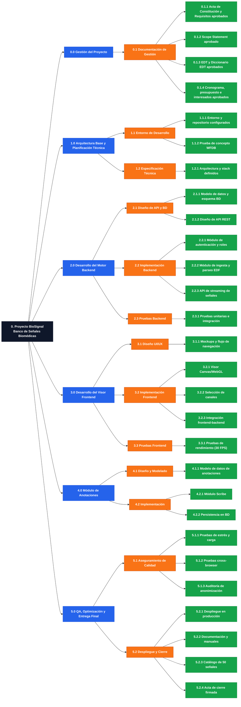

```
- **0. Proyecto BioSignal (Banco de Señales Biomédicas)**
  - **0.0 Gestión del Proyecto**
    - **0.1 Documentación de Gestión**
      - 0.1.1 Acta de Constitución y Requisitos aprobados
      - 0.1.2 Scope Statement aprobado
      - 0.1.3 EDT y Diccionario EDT aprobados
      - 0.1.4 Cronograma, presupuesto e interesados aprobados
  - **1.0 Arquitectura Base y Planificación Técnica**
    - **1.1 Entorno de Desarrollo**
      - 1.1.1 Entorno y repositorio configurados
      - 1.1.2 Prueba de concepto WFDB
    - **1.2 Especificación Técnica**
      - 1.2.1 Arquitectura y stack definidos
  - **2.0 Desarrollo del Motor Backend**
    - **2.1 Diseño de API y BD**
      - 2.1.1 Modelo de datos y esquema BD
      - 2.1.2 Diseño de API REST
    - **2.2 Implementación Backend**
      - 2.2.1 Módulo de autenticación y roles
      - 2.2.2 Módulo de ingesta y parseo EDF
      - 2.2.3 API de streaming de señales
    - **2.3 Pruebas Backend**
      - 2.3.1 Pruebas unitarias e integración
  - **3.0 Desarrollo del Visor Frontend**
    - **3.1 Diseño UI/UX**
      - 3.1.1 Mockups y flujo de navegación
    - **3.2 Implementación Frontend**
      - 3.2.1 Visor Canvas/WebGL
      - 3.2.2 Selección de canales
      - 3.2.3 Integración frontend-backend
    - **3.3 Pruebas Frontend**
      - 3.3.1 Pruebas de rendimiento (30 FPS)
  - **4.0 Módulo de Anotaciones**
    - **4.1 Diseño y Modelado**
      - 4.1.1 Modelo de datos de anotaciones
    - **4.2 Implementación**
      - 4.2.1 Módulo Scribe
      - 4.2.2 Persistencia en BD
  - **5.0 QA, Optimización y Entrega Final**
    - **5.1 Aseguramiento de Calidad**
      - 5.1.1 Pruebas de estrés y carga
      - 5.1.2 Pruebas cross-browser
      - 5.1.3 Auditoría de anonimización
    - **5.2 Despliegue y Cierre**
      - 5.2.1 Despliegue en producción
      - 5.2.2 Documentación y manuales
      - 5.2.3 Catálogo de 50 señales
      - 5.2.4 Acta de cierre firmada
```


# DICCIONARIO DEL EDT (WBS Dictionary)

| Nombre del Proyecto         | Siglas del Proyecto |
| --------------------------- | ------------------- |
| Banco de Señales Biomédicas | BioSignal           |

---

## Estructura del EDT (referencia de códigos)

| Código | Nivel       | Nombre                                    |
| ------ | ----------- | ----------------------------------------- |
| 0.0    | Fase        | Gestión del Proyecto                      |
| 0.1    | Subproducto | Documentación de Gestión                  |
| 1.0    | Fase        | Arquitectura Base y Planificación Técnica |
| 1.1    | Subproducto | Entorno de Desarrollo                     |
| 1.2    | Subproducto | Especificación Técnica                    |
| 2.0    | Fase        | Desarrollo del Motor Backend              |
| 2.1    | Subproducto | Diseño de API y Base de Datos             |
| 2.2    | Subproducto | Implementación Backend                    |
| 2.3    | Subproducto | Pruebas Backend                           |
| 3.0    | Fase        | Desarrollo del Visor Frontend             |
| 3.1    | Subproducto | Diseño UI/UX                              |
| 3.2    | Subproducto | Implementación Frontend                   |
| 3.3    | Subproducto | Pruebas Frontend                          |
| 4.0    | Fase        | Módulo de Anotaciones                     |
| 4.1    | Subproducto | Diseño y Modelado                         |
| 4.2    | Subproducto | Implementación                            |
| 5.0    | Fase        | QA, Optimización y Entrega Final          |
| 5.1    | Subproducto | Aseguramiento de Calidad                  |
| 5.2    | Subproducto | Despliegue y Cierre                       |

---

## 0.0 Gestión del Proyecto

### 0.1.1 — Acta de Constitución y Documento de Requisitos aprobados

| Campo                             | Contenido                                                                                                                                        |
| --------------------------------- | ------------------------------------------------------------------------------------------------------------------------------------------------ |
| **Código EDT**                    | 0.1.1                                                                                                                                            |
| **Denominación**                  | Acta de Constitución y Documento de Requisitos aprobados                                                                                         |
| **Objetivo**                      | Formalizar el inicio del proyecto y establecer la línea base de requisitos.                                                                      |
| **Descripción**                   | Documentos que definen propósito, objetivos SMART, stakeholders, alto nivel de requisitos (BR/StR/RF/RNF/TR/PR/QR) y restricciones del proyecto. |
| **Requisitos para iniciar**       | Reunión inicial con el Sponsor (EICA) realizada.                                                                                                 |
| **Actividades**                   | 0.1.1.1 Reunión con Sponsor · 0.1.1.2 Elaborar Acta de Constitución · 0.1.1.3 Elaborar Documento de Requisitos · 0.1.1.4 Revisión y firma        |
| **RACI**                          | Responsable: MA · Participa: IA · Apoya: — · Revisa: IA · Aprueba: AR                                                                            |
| **Fechas Programadas**            | Inicio: 01/Ago/2026 · Fin: 04/Ago/2026                                                                                                           |
| **Criterios de Aceptación**       | Firma del Acta por Sponsor y PM; documento de requisitos con trazabilidad completa (35 requisitos clasificados).                                 |
| **Supuestos**                     | El Sponsor dispone de tiempo para la reunión inicial en la primera semana del proyecto.                                                          |
| **Riesgos**                       | Que el Acta no sea aprobada a tiempo y retrase el inicio de la Fase 1.0.                                                                         |
| **Recursos y Costos**             | Personal: MA, IA · Estimado: ~10 hs-persona                                                                                                      |
| **Duración Estimada**             | 3 días                                                                                                                                           |
| **Dependencias**                  | Antes: — · Después: 0.1.2 Scope Statement                                                                                                        |
| **Consideraciones Contractuales** | No aplica.                                                                                                                                       |

### 0.1.2 — Scope Statement aprobado

| Campo                             | Contenido                                                                                                                                                    |
| --------------------------------- | ------------------------------------------------------------------------------------------------------------------------------------------------------------ |
| **Código EDT**                    | 0.1.2                                                                                                                                                        |
| **Denominación**                  | Scope Statement aprobado                                                                                                                                     |
| **Objetivo**                      | Definir con mayor detalle el alcance del proyecto y del producto.                                                                                            |
| **Descripción**                   | Documento con descripción del alcance, criterios de aceptación, entregables por fase, exclusiones, restricciones y supuestos.                                |
| **Requisitos para iniciar**       | Acta de Constitución aprobada.                                                                                                                               |
| **Actividades**                   | 0.1.2.1 Definir fases del proyecto · 0.1.2.2 Redactar criterios de aceptación · 0.1.2.3 Definir cronograma general por fase · 0.1.2.4 Revisión con el equipo |
| **RACI**                          | Responsable: MA · Participa: IA · Apoya: GH, MM, EC, RP · Revisa: IA · Aprueba: MA                                                                           |
| **Fechas Programadas**            | Inicio: 05/Ago/2026 · Fin: 07/Ago/2026                                                                                                                       |
| **Criterios de Aceptación**       | Documento revisado por el equipo, sin fases sin fecha ni entregable asociado.                                                                                |
| **Supuestos**                     | El PM conoce el objetivo del proyecto (ya validado en el Acta).                                                                                              |
| **Riesgos**                       | Que el Scope Statement no defina con claridad los criterios de aceptación por fase.                                                                          |
| **Recursos y Costos**             | Personal: MA, IA · Estimado: ~8 hs-persona                                                                                                                   |
| **Duración Estimada**             | 3 días                                                                                                                                                       |
| **Dependencias**                  | Antes: 0.1.1 Acta de Constitución · Después: 0.1.3 EDT y Diccionario EDT                                                                                     |
| **Consideraciones Contractuales** | No aplica.                                                                                                                                                   |

### 0.1.3 — EDT y Diccionario del EDT aprobados

| Campo                             | Contenido                                                                                                                                                                                        |
| --------------------------------- | ------------------------------------------------------------------------------------------------------------------------------------------------------------------------------------------------ |
| **Código EDT**                    | 0.1.3                                                                                                                                                                                            |
| **Denominación**                  | EDT y Diccionario del EDT aprobados                                                                                                                                                              |
| **Objetivo**                      | Descomponer el alcance en paquetes de trabajo gestionables y documentarlos.                                                                                                                      |
| **Descripción**                   | Estructura jerárquica Fase → Subproducto → Paquete de Trabajo, más la ficha descriptiva de cada paquete.                                                                                         |
| **Requisitos para iniciar**       | Scope Statement aprobado.                                                                                                                                                                        |
| **Actividades**                   | 0.1.3.1 Descomponer cada fase en subproductos · 0.1.3.2 Descomponer subproductos en paquetes de trabajo · 0.1.3.3 Elaborar ficha de diccionario por paquete · 0.1.3.4 Validar RACI con el equipo |
| **RACI**                          | Responsable: MA · Participa: IA · Apoya: GH, MM, EC, RP · Revisa: IA · Aprueba: MA                                                                                                               |
| **Fechas Programadas**            | Inicio: 08/Ago/2026 · Fin: 12/Ago/2026                                                                                                                                                           |
| **Criterios de Aceptación**       | Todo paquete de trabajo tiene código, responsable y criterios de aceptación definidos; sin paquetes huérfanos.                                                                                   |
| **Supuestos**                     | El equipo confirma disponibilidad y encaje de los roles asignados en el RACI.                                                                                                                    |
| **Riesgos**                       | Que la asignación de responsables no refleje las capacidades reales del equipo (ver observación de roles al inicio del documento).                                                               |
| **Recursos y Costos**             | Personal: MA, IA (+ validación de GH, MM, EC, RP) · Estimado: ~14 hs-persona                                                                                                                     |
| **Duración Estimada**             | 5 días                                                                                                                                                                                           |
| **Dependencias**                  | Antes: 0.1.2 Scope Statement · Después: 0.1.4 Cronograma detallado                                                                                                                               |
| **Consideraciones Contractuales** | No aplica.                                                                                                                                                                                       |

### 0.1.4 — Cronograma, presupuesto, interesados y riesgos aprobados

| Campo                             | Contenido                                                                                                                                                                             |
| --------------------------------- | ------------------------------------------------------------------------------------------------------------------------------------------------------------------------------------- |
| **Código EDT**                    | 0.1.4                                                                                                                                                                                 |
| **Denominación**                  | Cronograma, presupuesto, registro de interesados y de riesgos aprobados                                                                                                               |
| **Objetivo**                      | Establecer las líneas base de tiempo, costo, interesados y riesgos para ejecutar y controlar el proyecto.                                                                             |
| **Descripción**                   | Cronograma detallado por paquete de trabajo, presupuesto de horas, matriz de interesados y registro de riesgos (R1, R2, R3 del Acta y los que surjan del EDT).                        |
| **Requisitos para iniciar**       | EDT y Diccionario EDT aprobados.                                                                                                                                                      |
| **Actividades**                   | 0.1.4.1 Elaborar cronograma detallado (secuenciar paquetes) · 0.1.4.2 Elaborar presupuesto de horas · 0.1.4.3 Elaborar registro de interesados · 0.1.4.4 Elaborar registro de riesgos |
| **RACI**                          | Responsable: MA · Participa: IA · Apoya: GH, MM, EC, RP · Revisa: IA · Aprueba: AR                                                                                                    |
| **Fechas Programadas**            | Inicio: 13/Ago/2026 · Fin: 14/Ago/2026                                                                                                                                                |
| **Criterios de Aceptación**       | Documentos aprobados formalmente por el Sponsor antes del cierre del Hito 1.                                                                                                          |
| **Supuestos**                     | El Project Charter y el Scope Statement ya fueron aprobados.                                                                                                                          |
| **Riesgos**                       | Cambio de alcance del proyecto una vez aprobada la línea base.                                                                                                                        |
| **Recursos y Costos**             | Personal: MA, IA · Estimado: ~6 hs-persona                                                                                                                                            |
| **Duración Estimada**             | 2 días                                                                                                                                                                                |
| **Dependencias**                  | Antes: 0.1.3 EDT y Diccionario EDT · Después: Ejecución de Fases 1.0 a 5.0 (transversal)                                                                                              |
| **Consideraciones Contractuales** | No aplica.                                                                                                                                                                            |

---

## 1.0 Arquitectura Base y Planificación Técnica

### 1.1.1 — Entorno de desarrollo y repositorio configurados

| Campo                             | Contenido                                                                                                                                                                        |
| --------------------------------- | -------------------------------------------------------------------------------------------------------------------------------------------------------------------------------- |
| **Código EDT**                    | 1.1.1                                                                                                                                                                            |
| **Denominación**                  | Entorno de desarrollo y repositorio configurados                                                                                                                                 |
| **Objetivo**                      | Disponer de un entorno de trabajo común y versionado para todo el equipo.                                                                                                        |
| **Descripción**                   | Configuración de repositorio Git, estructura de carpetas frontend/backend, entorno local (Docker o similar) y convenciones de código.                                            |
| **Requisitos para iniciar**       | Cronograma y presupuesto aprobados.                                                                                                                                              |
| **Actividades**                   | 1.1.1.1 Crear repositorio · 1.1.1.2 Definir estructura de carpetas y ramas (branching) · 1.1.1.3 Configurar entorno local reproducible · 1.1.1.4 Documentar guía de contribución |
| **RACI**                          | Responsable: EC · Participa: MM, GH, RP · Apoya: — · Revisa: MA · Aprueba: MA                                                                                                    |
| **Fechas Programadas**            | Inicio: 01/Ago/2026 · Fin: 05/Ago/2026                                                                                                                                           |
| **Criterios de Aceptación**       | Todo el equipo puede clonar el repo y levantar el entorno local sin errores.                                                                                                     |
| **Supuestos**                     | El equipo cuenta con acceso a GitHub/GitLab institucional o gratuito.                                                                                                            |
| **Riesgos**                       | Incompatibilidad de entornos locales entre miembros del equipo (distintos SO).                                                                                                   |
| **Recursos y Costos**             | Personal: EC, MM · Estimado: ~10 hs-persona                                                                                                                                      |
| **Duración Estimada**             | 4 días                                                                                                                                                                           |
| **Dependencias**                  | Antes: 0.1.4 · Después: 1.1.2 Prueba de concepto WFDB                                                                                                                            |
| **Consideraciones Contractuales** | No aplica.                                                                                                                                                                       |

### 1.1.2 — Prueba de concepto de lectura de señales (WFDB, consola) aprobada

| Campo                             | Contenido                                                                                                                                                                 |
| --------------------------------- | ------------------------------------------------------------------------------------------------------------------------------------------------------------------------- |
| **Código EDT**                    | 1.1.2                                                                                                                                                                     |
| **Denominación**                  | Prueba de concepto de lectura de señales vía consola (librería WFDB)                                                                                                      |
| **Objetivo**                      | Validar técnicamente la viabilidad de leer y parsear archivos .edf antes de invertir en el desarrollo completo.                                                           |
| **Descripción**                   | Script de consola que usa la librería WFDB (Wave Form Data Base) para leer un archivo .edf de prueba y extraer frecuencia de muestreo y canales.                          |
| **Requisitos para iniciar**       | Entorno de desarrollo configurado.                                                                                                                                        |
| **Actividades**                   | 1.1.2.1 Investigar librería WFDB · 1.1.2.2 Conseguir archivo .edf de prueba · 1.1.2.3 Implementar script de lectura por consola · 1.1.2.4 Validar extracción de metadatos |
| **RACI**                          | Responsable: GH · Participa: EC · Apoya: — · Revisa: MA · Aprueba: MA                                                                                                     |
| **Fechas Programadas**            | Inicio: 06/Ago/2026 · Fin: 14/Ago/2026                                                                                                                                    |
| **Criterios de Aceptación**       | El script lee al menos un archivo .edf real y muestra frecuencia de muestreo y canales por consola sin errores.                                                           |
| **Supuestos**                     | Es posible conseguir un archivo .edf de prueba público (PhysioNet) antes de contar con datos reales de las facultades.                                                    |
| **Riesgos**                       | R1 del Acta: retraso en la entrega de datos reales — mitigado usando fuentes públicas desde este paquete.                                                                 |
| **Recursos y Costos**             | Personal: GH, EC · Estimado: ~25 hs-persona                                                                                                                               |
| **Duración Estimada**             | 7 días hábiles                                                                                                                                                            |
| **Dependencias**                  | Antes: 1.1.1 · Después: 1.2.1 Definición de arquitectura                                                                                                                  |
| **Consideraciones Contractuales** | No aplica.                                                                                                                                                                |

### 1.2.1 — Arquitectura y stack tecnológico definidos

| Campo                             | Contenido                                                                                                                                                                      |
| --------------------------------- | ------------------------------------------------------------------------------------------------------------------------------------------------------------------------------ |
| **Código EDT**                    | 1.2.1                                                                                                                                                                          |
| **Denominación**                  | Definición de arquitectura y tecnologías aprobada                                                                                                                              |
| **Objetivo**                      | Fijar la arquitectura técnica (frontend, backend, base de datos, hosting) que usará todo el desarrollo posterior.                                                              |
| **Descripción**                   | Documento de arquitectura: stack elegido, justificación, diagrama de componentes, decisión de motor de renderizado (Canvas vs WebGL) y proveedor cloud gratuito.               |
| **Requisitos para iniciar**       | Prueba de concepto WFDB aprobada.                                                                                                                                              |
| **Actividades**                   | 1.2.1.1 Evaluar alternativas de stack · 1.2.1.2 Definir motor de renderizado del visor · 1.2.1.3 Elegir proveedor cloud gratuito · 1.2.1.4 Documentar decisión de arquitectura |
| **RACI**                          | Responsable: EC · Participa: GH, MM, RP · Apoya: — · Revisa: MA · Aprueba: MA                                                                                                  |
| **Fechas Programadas**            | Inicio: 11/Ago/2026 · Fin: 14/Ago/2026                                                                                                                                         |
| **Criterios de Aceptación**       | Documento de arquitectura aprobado por el equipo completo, sin decisiones pendientes de tecnología.                                                                            |
| **Supuestos**                     | El hosting elegido cumple la restricción de $0 costo recurrente.                                                                                                               |
| **Riesgos**                       | R2 del Acta: elegir un stack que no soporte renderizado fluido de señales extensas.                                                                                            |
| **Recursos y Costos**             | Personal: EC, GH, MM, RP · Estimado: ~10 hs-persona                                                                                                                            |
| **Duración Estimada**             | 4 días                                                                                                                                                                         |
| **Dependencias**                  | Antes: 1.1.2 · Después: 2.1.1 Diseño de API y BD                                                                                                                               |
| **Consideraciones Contractuales** | No aplica.                                                                                                                                                                     |

---

## 2.0 Desarrollo del Motor Backend

### 2.1.1 — Modelo de datos y esquema de BD aprobado

| Campo                             | Contenido                                                                                                                                |
| --------------------------------- | ---------------------------------------------------------------------------------------------------------------------------------------- |
| **Código EDT**                    | 2.1.1                                                                                                                                    |
| **Denominación**                  | Modelo de datos y esquema de base de datos aprobado                                                                                      |
| **Objetivo**                      | Definir cómo se almacenan usuarios, señales, metadatos y anotaciones.                                                                    |
| **Descripción**                   | Modelo entidad-relación cubriendo usuarios/roles, catálogo de señales, metadatos EDF y estructura preparada para anotaciones (Fase 4.0). |
| **Requisitos para iniciar**       | Arquitectura y stack aprobados.                                                                                                          |
| **Actividades**                   | 2.1.1.1 Modelar entidades · 2.1.1.2 Definir relaciones y claves · 2.1.1.3 Revisar cumplimiento de anonimización (RNF-04)                 |
| **RACI**                          | Responsable: EC · Participa: GH · Apoya: — · Revisa: MA · Aprueba: MA                                                                    |
| **Fechas Programadas**            | Inicio: 15/Ago/2026 · Fin: 18/Ago/2026                                                                                                   |
| **Criterios de Aceptación**       | Modelo revisado no almacena campos que permitan reidentificar pacientes (QR-02).                                                         |
| **Supuestos**                     | Las facultades proveerán la estructura de metadatos esperada en los archivos .edf.                                                       |
| **Riesgos**                       | Cambios tardíos en requisitos de anonimización que obliguen a rediseñar el modelo.                                                       |
| **Recursos y Costos**             | Personal: EC, GH · Estimado: ~12 hs-persona                                                                                              |
| **Duración Estimada**             | 4 días                                                                                                                                   |
| **Dependencias**                  | Antes: 1.2.1 · Después: 2.1.2 Diseño de API REST                                                                                         |
| **Consideraciones Contractuales** | No aplica.                                                                                                                               |

### 2.1.2 — Diseño de API REST aprobado

| Campo                             | Contenido                                                                                                                                    |
| --------------------------------- | -------------------------------------------------------------------------------------------------------------------------------------------- |
| **Código EDT**                    | 2.1.2                                                                                                                                        |
| **Denominación**                  | Diseño de API REST aprobado                                                                                                                  |
| **Objetivo**                      | Definir los endpoints, contratos y formatos de respuesta antes de implementar.                                                               |
| **Descripción**                   | Especificación de endpoints para autenticación, carga/descarga de señales, streaming de muestras y (a futuro) anotaciones.                   |
| **Requisitos para iniciar**       | Modelo de datos aprobado.                                                                                                                    |
| **Actividades**                   | 2.1.2.1 Definir endpoints y verbos HTTP · 2.1.2.2 Definir formato JSON de streaming con metadatos · 2.1.2.3 Documentar API (OpenAPI/Swagger) |
| **RACI**                          | Responsable: GH · Participa: EC, MM · Apoya: — · Revisa: MA · Aprueba: MA                                                                    |
| **Fechas Programadas**            | Inicio: 19/Ago/2026 · Fin: 22/Ago/2026                                                                                                       |
| **Criterios de Aceptación**       | Documentación de API revisada y aprobada por el equipo backend antes de comenzar la implementación.                                          |
| **Supuestos**                     | El formato de streaming JSON propuesto es compatible con el motor de renderizado elegido en 1.2.1.                                           |
| **Riesgos**                       | Que el contrato de API deba cambiar durante el desarrollo del frontend, generando retrabajo.                                                 |
| **Recursos y Costos**             | Personal: GH, EC · Estimado: ~10 hs-persona                                                                                                  |
| **Duración Estimada**             | 4 días                                                                                                                                       |
| **Dependencias**                  | Antes: 2.1.1 · Después: 2.2.1 Implementación autenticación                                                                                   |
| **Consideraciones Contractuales** | No aplica.                                                                                                                                   |

### 2.2.1 — Módulo de autenticación y roles implementado

| Campo                             | Contenido                                                                                                                                                              |
| --------------------------------- | ---------------------------------------------------------------------------------------------------------------------------------------------------------------------- |
| **Código EDT**                    | 2.2.1                                                                                                                                                                  |
| **Denominación**                  | Módulo de autenticación y roles implementado                                                                                                                           |
| **Objetivo**                      | Controlar el acceso diferenciando Administrador/Bioingeniería de Consultor/Estudiante-Docente (RF-01).                                                                 |
| **Descripción**                   | Registro/login, manejo de sesión/token y control de permisos por rol.                                                                                                  |
| **Requisitos para iniciar**       | Diseño de API aprobado.                                                                                                                                                |
| **Actividades**                   | 2.2.1.1 Implementar registro/login · 2.2.1.2 Implementar manejo de sesión/token · 2.2.1.3 Implementar control de acceso por rol · 2.2.1.4 Pruebas unitarias del módulo |
| **RACI**                          | Responsable: GH · Participa: EC · Apoya: MM · Revisa: MA · Aprueba: MA                                                                                                 |
| **Fechas Programadas**            | Inicio: 23/Ago/2026 · Fin: 28/Ago/2026                                                                                                                                 |
| **Criterios de Aceptación**       | Un usuario Administrador y uno Consultor obtienen accesos distintos verificables en pruebas.                                                                           |
| **Supuestos**                     | No se requiere integración con sistema de identidad institucional de la UNViMe.                                                                                        |
| **Riesgos**                       | Vulnerabilidades de seguridad en el manejo de sesiones si no se prueba a fondo.                                                                                        |
| **Recursos y Costos**             | Personal: GH, EC · Estimado: ~18 hs-persona                                                                                                                            |
| **Duración Estimada**             | 6 días                                                                                                                                                                 |
| **Dependencias**                  | Antes: 2.1.2 · Después: 2.2.2 Ingesta y parseo EDF                                                                                                                     |
| **Consideraciones Contractuales** | No aplica.                                                                                                                                                             |

### 2.2.2 — Módulo de ingesta y parseo EDF implementado

| Campo                             | Contenido                                                                                                                                                                              |
| --------------------------------- | -------------------------------------------------------------------------------------------------------------------------------------------------------------------------------------- |
| **Código EDT**                    | 2.2.2                                                                                                                                                                                  |
| **Denominación**                  | Módulo de ingesta y parseo de archivos EDF implementado                                                                                                                                |
| **Objetivo**                      | Permitir la carga de archivos .edf con extracción automática de metadatos (RF-02).                                                                                                     |
| **Descripción**                   | Carga de archivo, verificación de formato .edf, extracción de frecuencia de muestreo y número de canales, almacenamiento del registro.                                                 |
| **Requisitos para iniciar**       | Módulo de autenticación implementado; POC de lectura WFDB validada (1.1.2).                                                                                                            |
| **Actividades**                   | 2.2.2.1 Implementar endpoint de carga · 2.2.2.2 Implementar verificación de formato .edf · 2.2.2.3 Implementar extracción de metadatos · 2.2.2.4 Pruebas con archivos reales/de prueba |
| **RACI**                          | Responsable: GH · Participa: EC · Apoya: MM · Revisa: MA · Aprueba: MA                                                                                                                 |
| **Fechas Programadas**            | Inicio: 29/Ago/2026 · Fin: 05/Sep/2026                                                                                                                                                 |
| **Criterios de Aceptación**       | El sistema rechaza archivos no-.edf y extrae correctamente metadatos de al menos 5 archivos de prueba distintos.                                                                       |
| **Supuestos**                     | Se dispone de un conjunto inicial de señales de prueba públicas (mitigación R1).                                                                                                       |
| **Riesgos**                       | R1 del Acta: demora en archivos reales de las facultades — mitigado con datos de PhysioNet.                                                                                            |
| **Recursos y Costos**             | Personal: GH, EC · Estimado: ~25 hs-persona                                                                                                                                            |
| **Duración Estimada**             | 7 días hábiles                                                                                                                                                                         |
| **Dependencias**                  | Antes: 2.2.1 · Después: 2.2.3 API de streaming                                                                                                                                         |
| **Consideraciones Contractuales** | No aplica.                                                                                                                                                                             |

### 2.2.3 — API de streaming de señales (JSON + metadatos) implementada

| Campo                             | Contenido                                                                                                                                                     |
| --------------------------------- | ------------------------------------------------------------------------------------------------------------------------------------------------------------- |
| **Código EDT**                    | 2.2.3                                                                                                                                                         |
| **Denominación**                  | API de streaming de muestras biomédicas implementada                                                                                                          |
| **Objetivo**                      | Entregar al frontend las muestras de señal en formato consumible para el visor.                                                                               |
| **Descripción**                   | Endpoint(s) de streaming/paginado de muestras en JSON con metadatos, optimizado para grandes volúmenes (chunking).                                            |
| **Requisitos para iniciar**       | Módulo de ingesta y parseo implementado.                                                                                                                      |
| **Actividades**                   | 2.2.3.1 Implementar streaming/chunking de muestras · 2.2.3.2 Implementar endpoint de exportación EDF (RF-05) · 2.2.3.3 Pruebas de carga con archivos extensos |
| **RACI**                          | Responsable: GH · Participa: EC, MM · Apoya: — · Revisa: MA · Aprueba: MA                                                                                     |
| **Fechas Programadas**            | Inicio: 06/Sep/2026 · Fin: 11/Sep/2026                                                                                                                        |
| **Criterios de Aceptación**       | La API entrega streaming estable para archivos de duración extensa sin timeouts; exportación reproduce un EDF válido.                                         |
| **Supuestos**                     | El volumen de datos de las señales de prueba es representativo de los reales.                                                                                 |
| **Riesgos**                       | R2 del Acta: latencia/congelamiento si el streaming no está bien optimizado — mitigado con chunking.                                                          |
| **Recursos y Costos**             | Personal: GH, EC, MM · Estimado: ~15 hs-persona                                                                                                               |
| **Duración Estimada**             | 6 días                                                                                                                                                        |
| **Dependencias**                  | Antes: 2.2.2 · Después: 2.3.1 Pruebas backend                                                                                                                 |
| **Consideraciones Contractuales** | No aplica.                                                                                                                                                    |

### 2.3.1 — Pruebas unitarias e integración de backend aprobadas

| Campo                             | Contenido                                                                                                                          |
| --------------------------------- | ---------------------------------------------------------------------------------------------------------------------------------- |
| **Código EDT**                    | 2.3.1                                                                                                                              |
| **Denominación**                  | Pruebas unitarias e integración de backend aprobadas                                                                               |
| **Objetivo**                      | Asegurar que el motor backend funciona de forma confiable antes de integrarlo con el frontend.                                     |
| **Descripción**                   | Suite de pruebas automatizadas sobre autenticación, ingesta/parseo y streaming; reporte de cobertura.                              |
| **Requisitos para iniciar**       | API de streaming implementada.                                                                                                     |
| **Actividades**                   | 2.3.1.1 Escribir pruebas unitarias por módulo · 2.3.1.2 Escribir pruebas de integración · 2.3.1.3 Ejecutar y documentar resultados |
| **RACI**                          | Responsable: GH · Participa: EC · Apoya: — · Revisa: MA · Aprueba: MA                                                              |
| **Fechas Programadas**            | Inicio: 12/Sep/2026 (paralelo al inicio de Fase 3.0) · Fin: 15/Sep/2026                                                            |
| **Criterios de Aceptación**       | Sin fallas críticas abiertas en el reporte de pruebas de backend.                                                                  |
| **Supuestos**                     | El equipo cuenta con tiempo para pruebas sin bloquear el arranque del frontend.                                                    |
| **Riesgos**                       | Descubrir errores críticos tarde, que impacten el cronograma de la Fase 3.0.                                                       |
| **Recursos y Costos**             | Personal: GH, EC · Estimado: ~10 hs-persona                                                                                        |
| **Duración Estimada**             | 4 días                                                                                                                             |
| **Dependencias**                  | Antes: 2.2.3 · Después: 3.2.3 Integración frontend-backend                                                                         |
| **Consideraciones Contractuales** | No aplica.                                                                                                                         |

---

## 3.0 Desarrollo del Visor Frontend

### 3.1.1 — Mockups y flujo de navegación aprobados

| Campo                             | Contenido                                                                                                                                           |
| --------------------------------- | --------------------------------------------------------------------------------------------------------------------------------------------------- |
| **Código EDT**                    | 3.1.1                                                                                                                                               |
| **Denominación**                  | Mockups y flujo de navegación aprobados                                                                                                             |
| **Objetivo**                      | Validar la experiencia de usuario antes de programar la interfaz.                                                                                   |
| **Descripción**                   | Wireframes/mockups de las pantallas principales (login, catálogo, visor, anotaciones) y flujo de navegación entre ellas.                            |
| **Requisitos para iniciar**       | Pruebas de backend en curso o completas (2.3.1).                                                                                                    |
| **Actividades**                   | 3.1.1.1 Diseñar wireframes de pantallas clave · 3.1.1.2 Definir flujo de navegación · 3.1.1.3 Validar usabilidad con 1-2 usuarios internos (RNF-01) |
| **RACI**                          | Responsable: RP · Participa: MM · Apoya: — · Revisa: MA · Aprueba: MA                                                                               |
| **Fechas Programadas**            | Inicio: 12/Sep/2026 · Fin: 16/Sep/2026                                                                                                              |
| **Criterios de Aceptación**       | Mockups aprobados por el equipo, sin pantallas clave pendientes de definir.                                                                         |
| **Supuestos**                     | Los usuarios finales no tienen conocimientos de programación (RNF-01), por lo que la UI debe ser simple.                                            |
| **Riesgos**                       | Que el diseño no contemple todos los controles necesarios del visor (zoom, paneo, amplitud, canales).                                               |
| **Recursos y Costos**             | Personal: RP, MM · Estimado: ~12 hs-persona                                                                                                         |
| **Duración Estimada**             | 5 días                                                                                                                                              |
| **Dependencias**                  | Antes: 2.3.1 (en paralelo) · Después: 3.2.1 Implementación del visor                                                                                |
| **Consideraciones Contractuales** | No aplica.                                                                                                                                          |

### 3.2.1 — Visor Canvas/WebGL con paneo, zoom y amplitud implementado

| Campo                             | Contenido                                                                                                                                                                                   |
| --------------------------------- | ------------------------------------------------------------------------------------------------------------------------------------------------------------------------------------------- |
| **Código EDT**                    | 3.2.1                                                                                                                                                                                       |
| **Denominación**                  | Visor gráfico (Canvas/WebGL) con paneo, zoom temporal y ajuste de amplitud                                                                                                                  |
| **Objetivo**                      | Entregar la funcionalidad central del producto: visualización interactiva de señales (RF-03).                                                                                               |
| **Descripción**                   | Componente de renderizado de la onda con controles de paneo continuo, zoom temporal y ajuste de amplitud, manteniendo mínimo 30 FPS (RNF-02).                                               |
| **Requisitos para iniciar**       | Mockups aprobados.                                                                                                                                                                          |
| **Actividades**                   | 3.2.1.1 Implementar renderizado base (Canvas/WebGL) · 3.2.1.2 Implementar controles de paneo y zoom · 3.2.1.3 Implementar ajuste de amplitud · 3.2.1.4 Optimizar rendimiento de renderizado |
| **RACI**                          | Responsable: RP · Participa: MM · Apoya: — · Revisa: MA · Aprueba: MA                                                                                                                       |
| **Fechas Programadas**            | Inicio: 17/Sep/2026 · Fin: 03/Oct/2026                                                                                                                                                      |
| **Criterios de Aceptación**       | Renderiza al menos 100 muestras simultáneas con latencia de carga inicial < 10 s; desplazamiento continuo a ≥30 FPS.                                                                        |
| **Supuestos**                     | El stack elegido en 1.2.1 soporta el rendimiento requerido.                                                                                                                                 |
| **Riesgos**                       | R2 del Acta: congelamiento del navegador con registros extensos.                                                                                                                            |
| **Recursos y Costos**             | Personal: RP, MM · Estimado: ~60 hs-persona                                                                                                                                                 |
| **Duración Estimada**             | 13 días hábiles                                                                                                                                                                             |
| **Dependencias**                  | Antes: 3.1.1 · Después: 3.2.2 Selección de canales                                                                                                                                          |
| **Consideraciones Contractuales** | No aplica.                                                                                                                                                                                  |

### 3.2.2 — Selección de canales implementada

| Campo                             | Contenido                                                                                                                                      |
| --------------------------------- | ---------------------------------------------------------------------------------------------------------------------------------------------- |
| **Código EDT**                    | 3.2.2                                                                                                                                          |
| **Denominación**                  | Selección de canales implementada                                                                                                              |
| **Objetivo**                      | Permitir al usuario elegir qué canales de la señal visualizar.                                                                                 |
| **Descripción**                   | Interfaz para mostrar/ocultar canales disponibles en el registro cargado.                                                                      |
| **Requisitos para iniciar**       | Visor base implementado.                                                                                                                       |
| **Actividades**                   | 3.2.2.1 Listar canales disponibles desde metadatos · 3.2.2.2 Implementar selección múltiple · 3.2.2.3 Sincronizar selección con el renderizado |
| **RACI**                          | Responsable: RP · Participa: MM · Apoya: — · Revisa: MA · Aprueba: MA                                                                          |
| **Fechas Programadas**            | Inicio: 04/Oct/2026 · Fin: 08/Oct/2026                                                                                                         |
| **Criterios de Aceptación**       | El usuario puede activar/desactivar canales y el visor se actualiza sin recargar la página.                                                    |
| **Supuestos**                     | Los metadatos de canales llegan correctamente desde la API (2.2.3).                                                                            |
| **Riesgos**                       | Inconsistencias entre metadatos del archivo y canales realmente disponibles.                                                                   |
| **Recursos y Costos**             | Personal: RP, MM · Estimado: ~15 hs-persona                                                                                                    |
| **Duración Estimada**             | 5 días                                                                                                                                         |
| **Dependencias**                  | Antes: 3.2.1 · Después: 3.2.3 Integración frontend-backend                                                                                     |
| **Consideraciones Contractuales** | No aplica.                                                                                                                                     |

### 3.2.3 — Integración frontend-backend (consumo de API) implementada

| Campo                             | Contenido                                                                                                                                         |
| --------------------------------- | ------------------------------------------------------------------------------------------------------------------------------------------------- |
| **Código EDT**                    | 3.2.3                                                                                                                                             |
| **Denominación**                  | Integración frontend-backend implementada                                                                                                         |
| **Objetivo**                      | Conectar el visor y el catálogo con la API real de backend, reemplazando datos mock.                                                              |
| **Descripción**                   | Consumo de endpoints de autenticación, catálogo, streaming y exportación desde el frontend.                                                       |
| **Requisitos para iniciar**       | Selección de canales implementada; pruebas de backend aprobadas (2.3.1).                                                                          |
| **Actividades**                   | 3.2.3.1 Integrar autenticación · 3.2.3.2 Integrar catálogo de señales · 3.2.3.3 Integrar streaming en el visor · 3.2.3.4 Integrar exportación EDF |
| **RACI**                          | Responsable: MM · Participa: RP, GH · Apoya: — · Revisa: MA · Aprueba: MA                                                                         |
| **Fechas Programadas**            | Inicio: 09/Oct/2026 · Fin: 16/Oct/2026                                                                                                            |
| **Criterios de Aceptación**       | Flujo completo end-to-end (login → catálogo → visualización → exportación) funcionando sin datos simulados.                                       |
| **Supuestos**                     | Los contratos de API definidos en 2.1.2 no cambiaron durante el desarrollo.                                                                       |
| **Riesgos**                       | Desalineación entre el contrato de API y lo realmente implementado en backend.                                                                    |
| **Recursos y Costos**             | Personal: MM, RP, GH · Estimado: ~25 hs-persona                                                                                                   |
| **Duración Estimada**             | 6 días                                                                                                                                            |
| **Dependencias**                  | Antes: 3.2.2, 2.3.1 · Después: 3.3.1 Pruebas de rendimiento                                                                                       |
| **Consideraciones Contractuales** | No aplica.                                                                                                                                        |

### 3.3.1 — Pruebas de rendimiento (30 FPS) aprobadas

| Campo                             | Contenido                                                                                                                                                             |
| --------------------------------- | --------------------------------------------------------------------------------------------------------------------------------------------------------------------- |
| **Código EDT**                    | 3.3.1                                                                                                                                                                 |
| **Denominación**                  | Pruebas de rendimiento del visor aprobadas                                                                                                                            |
| **Objetivo**                      | Confirmar que el visor cumple los objetivos de rendimiento antes del cierre de la fase (hito 23/Oct).                                                                 |
| **Descripción**                   | Pruebas de carga inicial (<10 s), FPS durante desplazamiento continuo (≥30) y comportamiento con archivos extensos.                                                   |
| **Requisitos para iniciar**       | Integración frontend-backend completa.                                                                                                                                |
| **Actividades**                   | 3.3.1.1 Medir latencia de carga inicial · 3.3.1.2 Medir FPS durante desplazamiento · 3.3.1.3 Probar con archivos de distinta duración · 3.3.1.4 Documentar resultados |
| **RACI**                          | Responsable: RP · Participa: MM, GH · Apoya: — · Revisa: MA · Aprueba: MA                                                                                             |
| **Fechas Programadas**            | Inicio: 17/Oct/2026 · Fin: 23/Oct/2026                                                                                                                                |
| **Criterios de Aceptación**       | Objetivo 1 del Acta cumplido: ≥100 muestras simultáneas, latencia <10 s, ≥30 FPS, antes del 23/Oct/2026.                                                              |
| **Supuestos**                     | El equipo de pruebas usa hardware/navegadores representativos de los usuarios finales.                                                                                |
| **Riesgos**                       | No alcanzar el rendimiento objetivo a tiempo, comprometiendo el Hito 3.                                                                                               |
| **Recursos y Costos**             | Personal: RP, MM, GH · Estimado: ~15 hs-persona                                                                                                                       |
| **Duración Estimada**             | 5 días                                                                                                                                                                |
| **Dependencias**                  | Antes: 3.2.3 · Después: 4.1.1 Diseño de anotaciones                                                                                                                   |
| **Consideraciones Contractuales** | No aplica.                                                                                                                                                            |

---

## 4.0 Módulo de Anotaciones

### 4.1.1 — Modelo de datos de anotaciones aprobado

| Campo                             | Contenido                                                                                                                           |
| --------------------------------- | ----------------------------------------------------------------------------------------------------------------------------------- |
| **Código EDT**                    | 4.1.1                                                                                                                               |
| **Denominación**                  | Modelo de datos de anotaciones aprobado                                                                                             |
| **Objetivo**                      | Definir cómo se estructuran y persisten los marcadores de eventos fisiológicos.                                                     |
| **Descripción**                   | Modelo de datos para anotaciones: tipo de evento, posición temporal, canal asociado, autor, timestamp.                              |
| **Requisitos para iniciar**       | Pruebas de rendimiento del visor aprobadas.                                                                                         |
| **Actividades**                   | 4.1.1.1 Modelar entidad de anotación · 4.1.1.2 Relacionar anotación con señal y canal · 4.1.1.3 Definir permisos de edición por rol |
| **RACI**                          | Responsable: EC · Participa: GH · Apoya: — · Revisa: MA · Aprueba: MA                                                               |
| **Fechas Programadas**            | Inicio: 24/Oct/2026 · Fin: 27/Oct/2026                                                                                              |
| **Criterios de Aceptación**       | Modelo revisado, soporta múltiples anotaciones por señal sin pérdida de referencia temporal.                                        |
| **Supuestos**                     | Solo usuarios autenticados (Consultor o Administrador) pueden crear anotaciones.                                                    |
| **Riesgos**                       | Que el modelo no escale bien si un registro tiene muchas anotaciones.                                                               |
| **Recursos y Costos**             | Personal: EC, GH · Estimado: ~8 hs-persona                                                                                          |
| **Duración Estimada**             | 4 días                                                                                                                              |
| **Dependencias**                  | Antes: 3.3.1 · Después: 4.2.1 Módulo Scribe                                                                                         |
| **Consideraciones Contractuales** | No aplica.                                                                                                                          |

### 4.2.1 — Módulo Scribe (creación/edición/guardado) implementado

| Campo                             | Contenido                                                                                                                                               |
| --------------------------------- | ------------------------------------------------------------------------------------------------------------------------------------------------------- |
| **Código EDT**                    | 4.2.1                                                                                                                                                   |
| **Denominación**                  | Módulo Scribe de anotaciones implementado                                                                                                               |
| **Objetivo**                      | Permitir marcar eventos fisiológicos directamente sobre la onda (RF-04).                                                                                |
| **Descripción**                   | Herramientas en el visor para crear, editar y eliminar anotaciones sobre la señal, integradas al frontend.                                              |
| **Requisitos para iniciar**       | Modelo de datos de anotaciones aprobado.                                                                                                                |
| **Actividades**                   | 4.2.1.1 Implementar UI de marcado sobre la onda · 4.2.1.2 Implementar edición/eliminación de anotaciones · 4.2.1.3 Conectar con backend de persistencia |
| **RACI**                          | Responsable: RP · Participa: GH, EC · Apoya: MM · Revisa: MA · Aprueba: MA                                                                              |
| **Fechas Programadas**            | Inicio: 28/Oct/2026 · Fin: 05/Nov/2026                                                                                                                  |
| **Criterios de Aceptación**       | El usuario puede crear, editar y eliminar una anotación y verla persistida tras recargar la página.                                                     |
| **Supuestos**                     | El rendimiento del visor (30 FPS) no se degrada al agregar anotaciones.                                                                                 |
| **Riesgos**                       | Conflictos de sincronización si dos usuarios anotan el mismo registro simultáneamente.                                                                  |
| **Recursos y Costos**             | Personal: RP, GH, EC · Estimado: ~25 hs-persona                                                                                                         |
| **Duración Estimada**             | 7 días hábiles                                                                                                                                          |
| **Dependencias**                  | Antes: 4.1.1 · Después: 4.2.2 Persistencia en BD                                                                                                        |
| **Consideraciones Contractuales** | No aplica.                                                                                                                                              |

### 4.2.2 — Persistencia de anotaciones en base de datos implementada

| Campo                             | Contenido                                                                                                                                 |
| --------------------------------- | ----------------------------------------------------------------------------------------------------------------------------------------- |
| **Código EDT**                    | 4.2.2                                                                                                                                     |
| **Denominación**                  | Persistencia de anotaciones en base de datos implementada                                                                                 |
| **Objetivo**                      | Garantizar que las anotaciones queden guardadas de forma confiable y recuperable.                                                         |
| **Descripción**                   | Endpoints de creación/lectura/actualización/eliminación (CRUD) de anotaciones y pruebas de persistencia.                                  |
| **Requisitos para iniciar**       | Módulo Scribe implementado en frontend.                                                                                                   |
| **Actividades**                   | 4.2.2.1 Implementar endpoints CRUD de anotaciones · 4.2.2.2 Pruebas de persistencia e integridad · 4.2.2.3 Pruebas de concurrencia básica |
| **RACI**                          | Responsable: GH · Participa: EC · Apoya: — · Revisa: MA · Aprueba: MA                                                                     |
| **Fechas Programadas**            | Inicio: 06/Nov/2026 · Fin: 10/Nov/2026                                                                                                    |
| **Criterios de Aceptación**       | Cero pérdida de datos en pruebas de guardado repetido; anotaciones recuperables tras reinicio del servidor.                               |
| **Supuestos**                     | El volumen de anotaciones esperado es manejable por la base de datos elegida sin optimizaciones adicionales.                              |
| **Riesgos**                       | Pérdida de anotaciones por fallos no controlados en el guardado.                                                                          |
| **Recursos y Costos**             | Personal: GH, EC · Estimado: ~10 hs-persona                                                                                               |
| **Duración Estimada**             | 4 días                                                                                                                                    |
| **Dependencias**                  | Antes: 4.2.1 · Después: 5.1.1 Pruebas de estrés                                                                                           |
| **Consideraciones Contractuales** | No aplica.                                                                                                                                |

---

## 5.0 QA, Optimización y Entrega Final

### 5.1.1 — Pruebas de estrés y carga aprobadas

| Campo                             | Contenido                                                                                                             |
| --------------------------------- | --------------------------------------------------------------------------------------------------------------------- |
| **Código EDT**                    | 5.1.1                                                                                                                 |
| **Denominación**                  | Pruebas de estrés y carga aprobadas                                                                                   |
| **Objetivo**                      | Verificar la estabilidad del sistema bajo condiciones exigentes antes del despliegue final.                           |
| **Descripción**                   | Pruebas con múltiples usuarios concurrentes, archivos extensos y transferencias simultáneas.                          |
| **Requisitos para iniciar**       | Persistencia de anotaciones implementada (todos los módulos funcionales completos).                                   |
| **Actividades**                   | 5.1.1.1 Diseñar escenarios de estrés · 5.1.1.2 Ejecutar pruebas de carga · 5.1.1.3 Registrar y corregir bugs críticos |
| **RACI**                          | Responsable: GH · Participa: EC, RP, MM · Apoya: — · Revisa: MA · Aprueba: MA                                         |
| **Fechas Programadas**            | Inicio: 11/Nov/2026 · Fin: 15/Nov/2026                                                                                |
| **Criterios de Aceptación**       | Cero fallas críticas abiertas en el reporte de estrés (QR-01).                                                        |
| **Supuestos**                     | El catálogo ya cuenta con al menos 50 conjuntos de señales cargados para pruebas realistas.                           |
| **Riesgos**                       | Encontrar fallas críticas tarde, con poco margen antes del cierre del 27/Nov.                                         |
| **Recursos y Costos**             | Personal: GH, EC, RP, MM · Estimado: ~15 hs-persona                                                                   |
| **Duración Estimada**             | 5 días                                                                                                                |
| **Dependencias**                  | Antes: 4.2.2 · Después: 5.1.2 Pruebas cross-browser                                                                   |
| **Consideraciones Contractuales** | No aplica.                                                                                                            |

### 5.1.2 — Pruebas cross-browser aprobadas

| Campo                             | Contenido                                                                                                                                                                       |
| --------------------------------- | ------------------------------------------------------------------------------------------------------------------------------------------------------------------------------- |
| **Código EDT**                    | 5.1.2                                                                                                                                                                           |
| **Denominación**                  | Pruebas cross-browser aprobadas                                                                                                                                                 |
| **Objetivo**                      | Confirmar equivalencia funcional en los navegadores soportados (RNF-03, QR-03).                                                                                                 |
| **Descripción**                   | Ejecución de casos de prueba funcionales en Chrome, Firefox y Edge, comparando resultados.                                                                                      |
| **Requisitos para iniciar**       | Pruebas de estrés aprobadas.                                                                                                                                                    |
| **Actividades**                   | 5.1.2.1 Ejecutar casos de prueba en Chrome · 5.1.2.2 Ejecutar casos de prueba en Firefox · 5.1.2.3 Ejecutar casos de prueba en Edge · 5.1.2.4 Documentar diferencias y corregir |
| **RACI**                          | Responsable: RP · Participa: GH · Apoya: MM · Revisa: MA · Aprueba: MA                                                                                                          |
| **Fechas Programadas**            | Inicio: 16/Nov/2026 · Fin: 19/Nov/2026                                                                                                                                          |
| **Criterios de Aceptación**       | Sin diferencias funcionales perceptibles entre navegadores en las pruebas cruzadas.                                                                                             |
| **Supuestos**                     | El equipo tiene acceso a los tres navegadores en al menos un sistema operativo cada uno.                                                                                        |
| **Riesgos**                       | Incompatibilidades específicas de un navegador con el motor de renderizado (Canvas/WebGL).                                                                                      |
| **Recursos y Costos**             | Personal: RP, GH · Estimado: ~8 hs-persona                                                                                                                                      |
| **Duración Estimada**             | 4 días                                                                                                                                                                          |
| **Dependencias**                  | Antes: 5.1.1 · Después: 5.1.3 Auditoría de anonimización                                                                                                                        |
| **Consideraciones Contractuales** | No aplica.                                                                                                                                                                      |

### 5.1.3 — Auditoría de anonimización aprobada

| Campo                             | Contenido                                                                                                                                              |
| --------------------------------- | ------------------------------------------------------------------------------------------------------------------------------------------------------ |
| **Código EDT**                    | 5.1.3                                                                                                                                                  |
| **Denominación**                  | Auditoría de anonimización aprobada                                                                                                                    |
| **Objetivo**                      | Certificar que ningún dato almacenado permite reidentificar a un paciente real (QR-02, RNF-04).                                                        |
| **Descripción**                   | Revisión técnica del modelo de datos y de los registros cargados, contrastando contra criterios éticos de salud.                                       |
| **Requisitos para iniciar**       | Pruebas cross-browser aprobadas.                                                                                                                       |
| **Actividades**                   | 5.1.3.1 Revisar campos almacenados por registro · 5.1.3.2 Verificar ausencia de metadatos identificables · 5.1.3.3 Documentar hallazgos y correcciones |
| **RACI**                          | Responsable: EC · Participa: GH · Apoya: — · Revisa: MA · Aprueba: MA                                                                                  |
| **Fechas Programadas**            | Inicio: 20/Nov/2026 · Fin: 21/Nov/2026                                                                                                                 |
| **Criterios de Aceptación**       | Auditoría sin hallazgos de datos reidentificables; informe firmado.                                                                                    |
| **Supuestos**                     | Los archivos provistos por las facultades ya llegaron anonimizados en origen.                                                                          |
| **Riesgos**                       | Que un archivo real llegue sin anonimizar correctamente y deba rechazarse cerca del cierre.                                                            |
| **Recursos y Costos**             | Personal: EC, GH · Estimado: ~6 hs-persona                                                                                                             |
| **Duración Estimada**             | 2 días                                                                                                                                                 |
| **Dependencias**                  | Antes: 5.1.2 · Después: 5.2.1 Despliegue en producción                                                                                                 |
| **Consideraciones Contractuales** | No aplica.                                                                                                                                             |

### 5.2.1 — Despliegue en producción (Release 1.0) aprobado

| Campo                             | Contenido                                                                                                                                                               |
| --------------------------------- | ----------------------------------------------------------------------------------------------------------------------------------------------------------------------- |
| **Código EDT**                    | 5.2.1                                                                                                                                                                   |
| **Denominación**                  | Despliegue en producción — Release 1.0                                                                                                                                  |
| **Objetivo**                      | Poner el sistema en funcionamiento definitivo para su uso académico.                                                                                                    |
| **Descripción**                   | Despliegue en servidor institucional de la UNViMe o plataforma cloud gratuita (Vercel/Render), incluyendo configuración de dominio/URL de acceso.                       |
| **Requisitos para iniciar**       | Auditoría de anonimización aprobada.                                                                                                                                    |
| **Actividades**                   | 5.2.1.1 Configurar entorno de producción · 5.2.1.2 Desplegar backend y frontend · 5.2.1.3 Verificar URL de producción funcionando · 5.2.1.4 Configurar monitoreo básico |
| **RACI**                          | Responsable: EC · Participa: MM · Apoya: GH · Revisa: MA · Aprueba: AR                                                                                                  |
| **Fechas Programadas**            | Inicio: 22/Nov/2026 · Fin: 24/Nov/2026                                                                                                                                  |
| **Criterios de Aceptación**       | La URL de producción responde correctamente y aloja la versión Release 1.0 (TR-03), a costo $0 de infraestructura comercial.                                            |
| **Supuestos**                     | La UNViMe garantiza disponibilidad de infraestructura o permisos cloud en tiempo y forma.                                                                               |
| **Riesgos**                       | Indisponibilidad de la infraestructura institucional cerca de la fecha límite.                                                                                          |
| **Recursos y Costos**             | Personal: EC, MM, GH · Estimado: ~12 hs-persona                                                                                                                         |
| **Duración Estimada**             | 3 días                                                                                                                                                                  |
| **Dependencias**                  | Antes: 5.1.3 · Después: 5.2.2 Documentación y manuales                                                                                                                  |
| **Consideraciones Contractuales** | No aplica.                                                                                                                                                              |

### 5.2.2 — Documentación técnica y manuales de usuario entregados

| Campo                             | Contenido                                                                                                                                    |
| --------------------------------- | -------------------------------------------------------------------------------------------------------------------------------------------- |
| **Código EDT**                    | 5.2.2                                                                                                                                        |
| **Denominación**                  | Documentación técnica y manuales de usuario entregados                                                                                       |
| **Objetivo**                      | Garantizar la mantenibilidad del sistema y facilitar su uso sin soporte técnico directo (RNF-01).                                            |
| **Descripción**                   | Documentación de arquitectura, componentes, API y dependencias; manuales para administradores y usuarios finales.                            |
| **Requisitos para iniciar**       | Despliegue en producción aprobado.                                                                                                           |
| **Actividades**                   | 5.2.2.1 Redactar documentación técnica de arquitectura · 5.2.2.2 Redactar manual de administrador · 5.2.2.3 Redactar manual de usuario final |
| **RACI**                          | Responsable: IA · Participa: EC, GH, RP, MM · Apoya: — · Revisa: MA · Aprueba: MA                                                            |
| **Fechas Programadas**            | Inicio: 24/Nov/2026 · Fin: 26/Nov/2026                                                                                                       |
| **Criterios de Aceptación**       | Documentación permite a un tercero entender la arquitectura sin consultar al equipo original.                                                |
| **Supuestos**                     | No se requiere traducción a otro idioma.                                                                                                     |
| **Riesgos**                       | Documentación incompleta si se prioriza el cierre técnico sobre la redacción.                                                                |
| **Recursos y Costos**             | Personal: IA (+ todo el equipo como fuente) · Estimado: ~10 hs-persona                                                                       |
| **Duración Estimada**             | 3 días                                                                                                                                       |
| **Dependencias**                  | Antes: 5.2.1 · Después: 5.2.4 Acta de cierre                                                                                                 |
| **Consideraciones Contractuales** | No aplica.                                                                                                                                   |

### 5.2.3 — Catálogo de 50 señales cargado y categorizado

| Campo                             | Contenido                                                                                                                                                 |
| --------------------------------- | --------------------------------------------------------------------------------------------------------------------------------------------------------- |
| **Código EDT**                    | 5.2.3                                                                                                                                                     |
| **Denominación**                  | Catálogo base de señales cargado y categorizado                                                                                                           |
| **Objetivo**                      | Dejar el sistema con contenido real utilizable desde el día de entrega (TR-02).                                                                           |
| **Descripción**                   | Carga y categorización de al menos 50 conjuntos de señales biomédicas (reales o de referencia) con sus metadatos.                                         |
| **Requisitos para iniciar**       | Módulo de gestión de señales funcional (Fase 2.0) y catálogo disponible en frontend (Fase 3.0).                                                           |
| **Actividades**                   | 5.2.3.1 Recopilar señales de prueba/reales anonimizadas · 5.2.3.2 Cargar y categorizar en el sistema · 5.2.3.3 Verificar metadatos correctos por registro |
| **RACI**                          | Responsable: IA · Participa: GH, EC · Apoya: — · Revisa: MA · Aprueba: MA                                                                                 |
| **Fechas Programadas**            | Inicio: 12/Sep/2026 (en paralelo, a medida que el sistema lo permita) · Fin: 10/Nov/2026                                                                  |
| **Criterios de Aceptación**       | Catálogo con 50 o más conjuntos de señales publicados y accesibles (TR-02).                                                                               |
| **Supuestos**                     | Las facultades y/o fuentes públicas (PhysioNet) proveen suficiente cantidad de señales anonimizadas.                                                      |
| **Riesgos**                       | R1 del Acta: no alcanzar las 50 señales a tiempo por demoras de las facultades.                                                                           |
| **Recursos y Costos**             | Personal: IA, GH, EC · Estimado: ~15 hs-persona (distribuidas en el tiempo)                                                                               |
| **Duración Estimada**             | Actividad continua, ~2 meses                                                                                                                              |
| **Dependencias**                  | Antes: 2.2.2 (ingesta funcional) · Después: 5.1.1 (pruebas de estrés necesitan datos reales)                                                              |
| **Consideraciones Contractuales** | No aplica.                                                                                                                                                |

### 5.2.4 — Acta de cierre firmada

| Campo                             | Contenido                                                                                                                                     |
| --------------------------------- | --------------------------------------------------------------------------------------------------------------------------------------------- |
| **Código EDT**                    | 5.2.4                                                                                                                                         |
| **Denominación**                  | Acta de cierre del proyecto firmada                                                                                                           |
| **Objetivo**                      | Formalizar el cierre del proyecto ante el Sponsor.                                                                                            |
| **Descripción**                   | Documento de cierre que confirma cumplimiento de objetivos, entregables y criterios de aceptación, con firma de las partes.                   |
| **Requisitos para iniciar**       | Documentación técnica y manuales entregados.                                                                                                  |
| **Actividades**                   | 5.2.4.1 Verificar cumplimiento de objetivos SMART y criterios de éxito · 5.2.4.2 Redactar Acta de Cierre · 5.2.4.3 Firma del Sponsor y del PM |
| **RACI**                          | Responsable: MA · Participa: IA · Apoya: — · Revisa: IA · Aprueba: AR                                                                         |
| **Fechas Programadas**            | Inicio: 26/Nov/2026 · Fin: 27/Nov/2026                                                                                                        |
| **Criterios de Aceptación**       | Acta firmada por el representante institucional de la UNViMe y el PM, antes o el 27/Nov/2026.                                                 |
| **Supuestos**                     | Todos los entregables previos fueron aprobados sin objeciones pendientes.                                                                     |
| **Riesgos**                       | Objeciones de último momento del Sponsor que impidan cerrar en la fecha límite.                                                               |
| **Recursos y Costos**             | Personal: MA, IA · Estimado: ~4 hs-persona                                                                                                    |
| **Duración Estimada**             | 2 días                                                                                                                                        |
| **Dependencias**                  | Antes: 5.2.2, 5.2.3 · Después: — (fin del proyecto)                                                                                           |
| **Consideraciones Contractuales** | No aplica.                                                                                                                                    |

---

## Resumen de asignación por integrante (para validar)

| Integrante                             | Paquetes como Responsable                              |
| -------------------------------------- | ------------------------------------------------------ |
| **MA** (Astudillo — PM)                | 0.1.1, 0.1.2, 0.1.3, 0.1.4, 5.2.4                      |
| **IA** (Ávila Gelbes — Asist. PM)      | 5.2.2, 5.2.3                                           |
| **GH** (Herrera — Backend/QA)          | 1.1.2, 2.1.2, 2.2.1, 2.2.2, 2.2.3, 2.3.1, 4.2.2, 5.1.1 |
| **EC** (Chiecher — Backend/Infra)      | 1.1.1, 1.2.1, 2.1.1, 4.1.1, 5.1.3, 5.2.1               |
| **RP** (Pereyra — Frontend)            | 3.1.1, 3.2.1, 3.2.2, 3.3.1, 4.2.1, 5.1.2               |
| **MM** (Mosainer — Full-Stack/Soporte) | 3.2.3                                                  |
