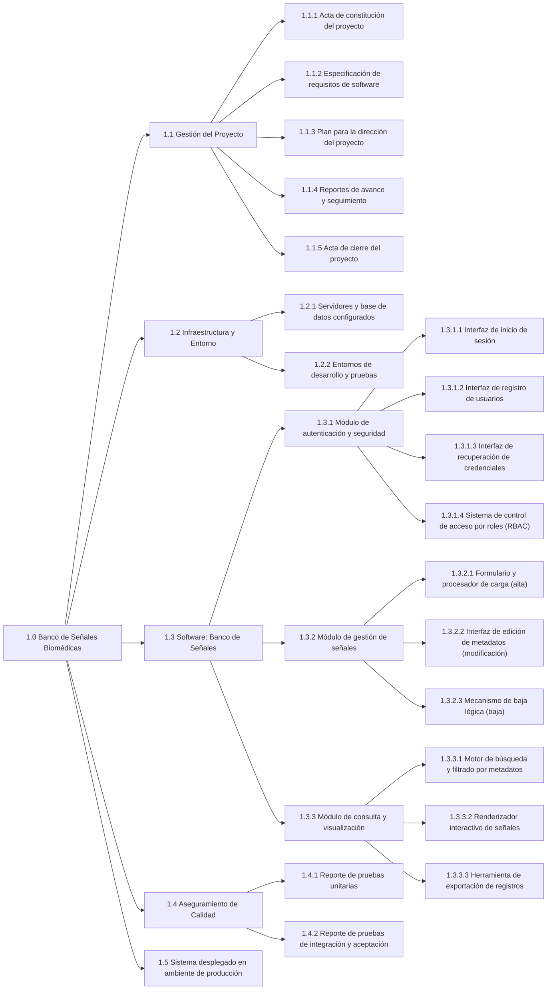

1.0 Banco de Señales Biomédicas
    1.1 Gestión del Proyecto
        1.1.1 Acta de constitución del proyecto
        1.1.2 Especificación de requisitos de software
        1.1.3 Plan para la dirección del proyecto
        1.1.4 Reportes de avance y seguimiento
        1.1.5 Acta de cierre del proyecto
    1.2 Infraestructura y Entorno
        1.2.1 Servidores y base de datos configurados
        1.2.2 Entornos de desarrollo y pruebas
    1.3 Software: Banco de Señales
        1.3.1 Módulo de autenticación y seguridad
            1.3.1.1 Interfaz de inicio de sesión
            1.3.1.2 Interfaz de registro de usuarios
            1.3.1.3 Interfaz de recuperación de credenciales
            1.3.1.4 Sistema de control de acceso por roles (RBAC)
        1.3.2 Módulo de gestión de señales
            1.3.2.1 Formulario y procesador de carga (alta)
            1.3.2.2 Interfaz de edición de metadatos (modificación)
            1.3.2.3 Mecanismo de baja lógica (baja)
        1.3.3 Módulo de consulta y visualización
            1.3.3.1 Motor de búsqueda y filtrado por metadatos
            1.3.3.2 Renderizador interactivo de señales
            1.3.3.3 Herramienta de exportación de registros
    1.4 Aseguramiento de Calidad
        1.4.1 Reporte de pruebas unitarias
        1.4.2 Reporte de pruebas de integración y aceptación
	1.5 Sistema desplegado en ambiente de producción

