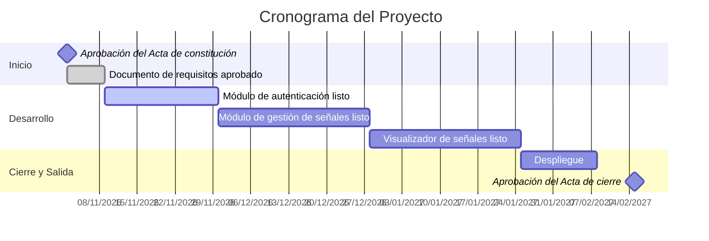

```mermaid
gantt
    title Cronograma del Proyecto
    dateFormat  YYYY-MM-DD
    axisFormat  %d/%m/%Y

    section Inicio
    Aprobación del Acta de constitución :milestone, m1, 2026-11-02, 0d
    Documento de requisitos aprobado   :done, req, after m1, 7d

    section Desarrollo
    Módulo de autenticación listo       :active, auth, after req, 21d
    Módulo de gestión de señales listo  :senales, after auth, 28d
    Visualizador de señales listo       :vis, after senales, 28d

    section Cierre y Salida
    Despliegue                          :desp, after vis, 14d
    Aprobación del Acta de cierre       :milestone, m2, 2027-02-15,
```
